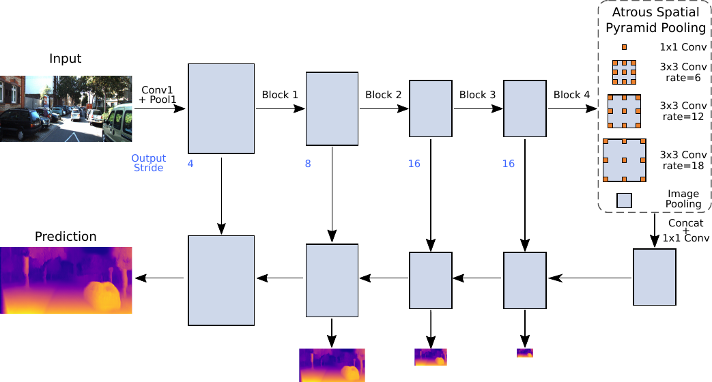
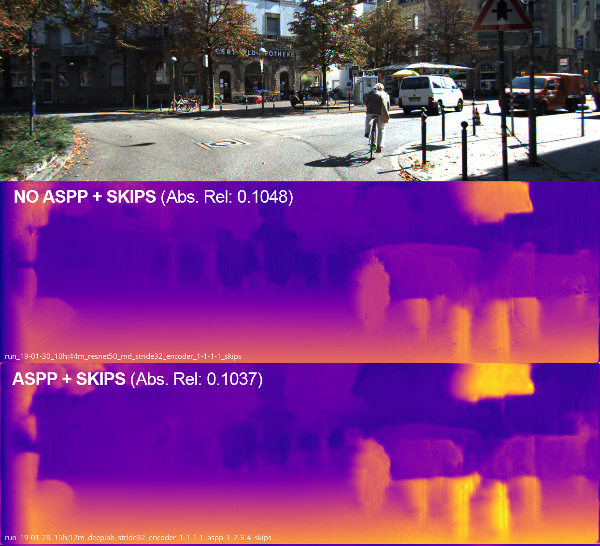

# Monocular Depth Estimation with Atrous Convolutions

This repo contains code for the Deep Learning in Computer Vision practical course at TU Darmstadt. The project's goal is to test whether atrous convolutions (convolutions with dilated kernels) can improve monocular depth estimation. We base our implementation upon [Unsupervised single image depth prediction with CNNs](https://github.com/mrharicot/monodepth) and improve the ResNet backbone using ideas from the semantic segmentation network [DeepLab v3+](https://github.com/tensorflow/models/tree/master/research/deeplab). Atrous convolutions might help in using information at different spatial scales without introducing lots of new parameters.

We also provide a [paper](./paper/DLCV_Final_Report.pdf) and a [presentation](./presentation/dlcv_final_presentation.pdf) on our findings.

##### Paper Abstract

Monocular depth estimation is concerned with computing a dense depth map from a single image but faces difficulties especially at object boundaries.
Atrous convolutions have been successfully employed to this end in the task of semantic segmentation.
In this paper, we investigate, whether it is  also possible to apply atrous convolutions in unsupervised monocular depth estimation. 
Specifically, we place an Atrous Spatial Pyramid Pooling block in a convolutional neural network between the encoder and decoder. 
This block allows for computing feature maps at different spatial scales on top of the encoder output. 
Our experiments show that atrous convolutions in the proposed setup do not improve depth estimation performance. 
Furthermore, the necessity of a lower output stride after the encoder, such that an increased receptive field size is even applicable, harms runtime and increases memory consumption. 
Finally, we show that it is possible to reduce the number of channels after the encoder, which reduces the parameter count without impairing predictions.

## Summary

### Main Network Architecture

### Depth Estimates with and without ASPP Block

### Final Model Evaluations

| Model    | Output-Stride | ASPP    |   Abs.Rel. |    Sq.Rel. |      RMSE |  Log RMSE |        a1 |        a2 |        a3 | Params (M) | Delta Abs. Rel. (%) |
|----------|---------------|---------|------------|------------|-----------|-----------|-----------|-----------|-----------|------------|------------------------|
| Godard   |            64 | -       |     0.0970 |     0.8960 |     5.093 |     0.176 |     0.962 |     0.962 |     0.986 |       58.4 | --                     |
| Godard   |            16 | -       |     0.0955 |     0.8752 |     4.937 |     0.174 |     0.881 |     0.961 |     0.984 |       58.4 | 2.57                   |
| Ours (A) |            16 | 1-1-1-1 | **0.0927** | **0.8132** | **4.865** | **0.168** | **0.888** | **0.967** | **0.987** |       58.4 | **4.43**               |
| Ours (B) |            16 | 1       |     0.0944 |     0.8446 |     5.011 |     0.174 |     0.884 |     0.963 |     0.986 |   **44.1** | 2.68                   |

## Useful Links
### Original implementations
- [DeepLab v3+](https://github.com/tensorflow/models/tree/master/research/deeplab)
- [Unsupervised Monodepth](https://github.com/mrharicot/monodepth)
### PyTorch implementations
- [DeepLab v3+](https://github.com/jfzhang95/pytorch-deeplab-xception)
- [Unsupervised Monodepth](https://github.com/ClubAI/MonoDepth-PyTorch)

## Coding Style
- Code Formatter: [black](https://github.com/ambv/black)
- Docstring: [Google Style](https://www.chromium.org/chromium-os/python-style-guidelines)

## How to run
The code runs on Python 3.6+, Pytorch 0.4.1 and has a couple of other requirements, which are stated in `requirements.txt` and can be easily installed in a virtualenv by running `setup-env.sh`.

### Training
You can train a model by running `main.py`, which is parametrized with the following main arguments (run `python main.py -h` for information on all arguments):
- `--model`: model type, e.g. "resnet50_md" or "deeplab"
- `--filenames-file`: file that contains a list of filenames for training (left and right image separated by a space)
- `--val-filenames-file`: same as above, but for validation set
- `--data-dir`: root directory, filenames in filename files are relative to this path
- `--output-dir`: path for results generated during a run (tensorboard, plots, checkpoints)
- `--epochs`: number of epochs to be trained
- `--batch-size`: number of images per batch
- `--cuda-device-ids`: GPUs on which to train, -1 for cpu only

### Testing
Testing on a dataset of choice is automatically performed after training (if the argument `--test-filenames-file` is set). If you want to manually test a given model, running `test.py` and providing a `--checkpoint` will also work (run `python test.py -h` for information on all arguments).

### Evaluation
Evaluation is implemented on the KITTI Stereo 2015 dataset or the Eigen split of the KITTI dataset. It is automatically evoked after training if `--eval` is set to `kitti-gt` or `eigen`. If you want to manually run evaluation on a given `.npy` file containing the output disparities on the respective dataset, you can do so by running `evaluate.py` (run `python evaluate.py -h` for information on all arguments).
